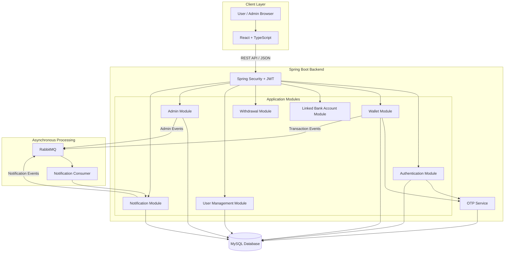

# System Architecture Diagram - Hệ thống E-Wallet

```mermaid
flowchart TB
    %% =========================
    %% CLIENT
    %% =========================

    subgraph CLIENT["Client Layer"]
        Browser[User / Admin Browser]
        Frontend[React + TypeScript]
        Browser --> Frontend
    end

    %% =========================
    %% BACKEND
    %% =========================

    subgraph BACKEND["Spring Boot Backend"]
        Security[Spring Security + JWT]

        subgraph MODULES["Application Modules"]
            Auth[Authentication Module]
            Wallet[Wallet Module]
            LinkedBank[Linked Bank Account Module]
            Withdrawal[Withdrawal Module]
            UserSvc[User Management Module]
            AdminSvc[Admin Module]
            NotificationSvc[Notification Module]
        end

        OTP[OTP Service]
    end

    Frontend -->|REST API / JSON| Security
    Security --> Auth
    Security --> Wallet
    Security --> LinkedBank
    Security --> Withdrawal
    Security --> UserSvc
    Security --> AdminSvc
    Security --> NotificationSvc

    Auth --> OTP
    Wallet --> OTP

    %% =========================
    %% DATABASE
    %% =========================

    DB[(MySQL Database)]

    Auth --> DB
    Wallet --> DB
    UserSvc --> DB
    AdminSvc --> DB
    NotificationSvc --> DB
    OTP --> DB

    %% =========================
    %% MESSAGE QUEUE
    %% =========================

    subgraph ASYNC["Asynchronous Processing"]
        MQ[RabbitMQ]
        Consumer[Notification Consumer]
    end

    Wallet -->|Transaction Events| MQ
    AdminSvc -->|Admin Events| MQ
    NotificationSvc -->|Notification Events| MQ

    MQ --> Consumer
    Consumer --> NotificationSvc
```
