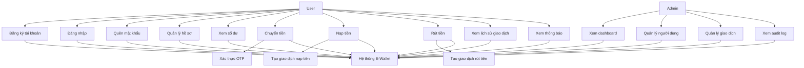

# Lược đồ Use Case - Hệ thống E-Wallet

```mermaid
flowchart TD
    U[User] --> UC1[Đăng ký tài khoản]
    U --> UC2[Đăng nhập]
    U --> UC3[Quên mật khẩu]
    U --> UC4[Quản lý hồ sơ]
    U --> UC5[Xem số dư]
    U --> UC6[Chuyển tiền]
    U --> UC7[Nạp tiền]
    U --> UC8[Rút tiền]
    U --> UC9[Xem lịch sử giao dịch]
    U --> UC10[Xem thông báo]

    A[Admin] --> AC1[Xem dashboard]
    A --> AC2[Quản lý người dùng]
    A --> AC3[Quản lý giao dịch]
    A --> AC4[Xem audit log]

    UC6 --> UC6A[ Xác thực OTP ]
    UC7 --> UC7A[ Tạo giao dịch nạp tiền ]
    UC8 --> UC8A[ Tạo giao dịch rút tiền ]

    UC1 --> S[Hệ thống E-Wallet]
    UC2 --> S
    UC3 --> S
    UC4 --> S
    UC5 --> S
    UC6 --> S
    UC7 --> S
    UC8 --> S
    UC9 --> S
    UC10 --> S
    AC1 --> S
    AC2 --> S
    AC3 --> S
    AC4 --> S
```
